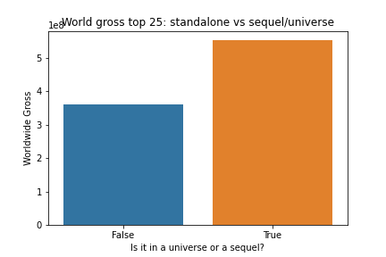
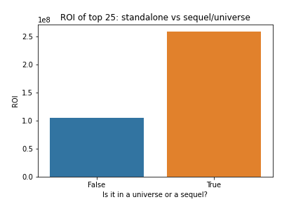
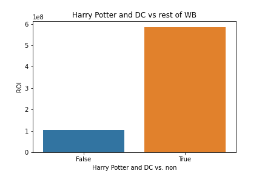
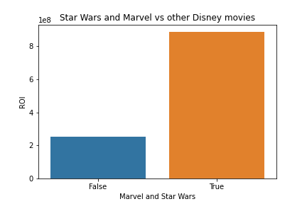
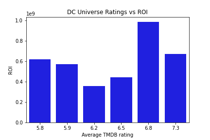
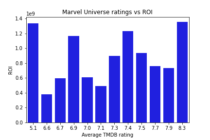

# Project 1

### Overview
The goal of this project is to delve into the movie industry and analyze how Microsoft could break in.  A vast number of movies that come out now are either sequels, spin-offs, reboots or just generally in the same sphere as another previously made movie.  These giant pieces of intellectual property dominate the cinematic landscape whether it’s Marvel or Harry Potter. Microsoft can use the templates set before them to create their own cinematic universe based on one of the many IPs at their disposal.

### Questions
The goal of this project was to investigate three points: 
1.	How much do sequels or movies that are part of cinematic universe dominate the box office and how much money they generate versus the other movies.
2.	How much do studios make within the realm of their cinematic universes versus the other movies they produce.  
3.	Do ratings have an impact on whether the movies within a cinematic universe draw revenue, or do the ratings not matter and people will flock to see the new giant blockbuster that triggers a bit of nostalgia. 

### Data and methods
The data used for this project was gathered from Rotten Tomatoes, IMDb, The Numbers, The Movie Database and Box Office Mojo:  

* zippedData/imdb.name.basics.csv.gz
* zippedData/rt.movie_info.tsv.gz
* zippedData/tn.movie_budgets.csv.gz
* zippedData/tmdb.movies.csv.gz
* zippedData/bom.movie_gross.csv.gz

These databases compile ratings, box office revenues, movie details and budgets.  Using joins, I was able to create databases that I could then use to compare and contrast data:
\n
* How much the movies in the top 25 highest grossing worldwide have made and which ones are sequels or part of a cinematic universe.
* Ratings vs return on investment (ROI).
* How much a specific set of movies in a cinematic universe grossed worldwide against the rest of the movies that a studio has made.

### Results
Through the data, we see that movies that are part of big franchises or are the sequel to a movie make up twenty out of twenty five of the highest grossing movies based on Box Office Mojo’s database of highest grossing movies.  

The reason that studios devote so much time, energy and marketing power to each of these massive franchises is because they are the largest sources of revenue to the respective movie studios.  

The movies that Marvel Studios have produced are generally considered to be good movies, both based on critical evidence and through the ratings compiled by The Movie Database. DC Comics’ movies, on the other hand, are not considered to be good movies by these same metrics.  Yet, both universes have contributed to a high ROI for Disney and Warner Brothers, respectively. 

### Conclusions
* **Use your IP** – The recent acquisition by Microsoft of Bethesda Softworks has opened up a library of IP for them to play with and potentially make movie universes out of. Microsoft already owns Halo, which can be a cinematic universe in its own right.
* **Cross-generation enjoyment** – Whether it’s nostalgia for the older generations or  watching superheroes fight bad guys with hammers and jet packs, these movies bring in a massive audience that hasn’t waned since they first began to come out.
* **Catch on while you can** – Multiple movie studios have begun trying to “boot up” cinematic universes, showing us that this trend will not cease.  If Microsoft wants to create a successful movie franchise, they should catch on to this wave while they can.

### Next steps  
* **More than the top 25** – Analysis of more than just the top 25 grossing movies could yield a more succinct analysis of movie trends when it comes to universes and sequels.
* **More sequels and standalones** – With more data on movie details and ratings, research could be done to look into whether there is a steady or steep decline in standalone movies and how well they do at the box office.
* **Desire video game movies** – Further research could show whether there’s a desire by the large fanbases for each video game franchise for movies to be produced and how video game movies have done in the past in terms of ROI.

